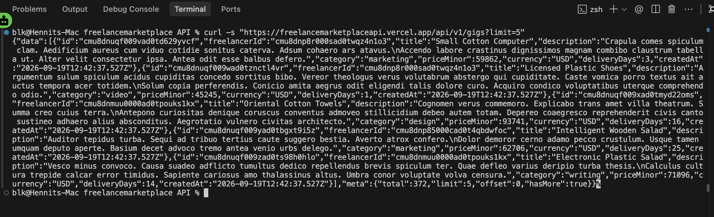
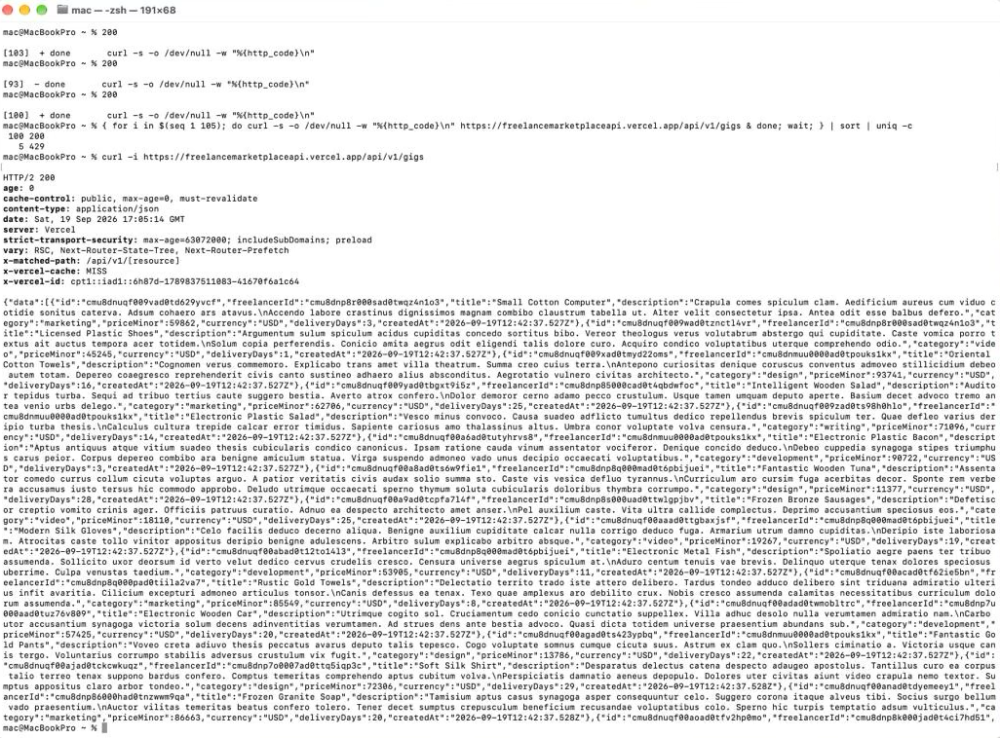
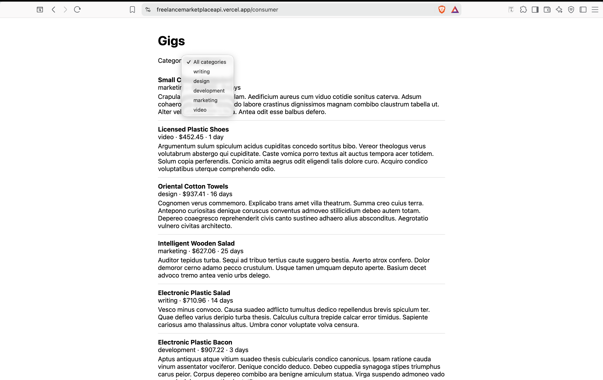

# Freelance Marketplace API

A public read API built with Next.js 14 App Router, strict TypeScript, Prisma/PostgreSQL, Zod, and Upstash Redis. It exposes freelancers, clients, gigs, orders, and reviews, plus order creation. A single consumer page at `/consumer` lists gigs from the deployed API with a category filter and a next-page button; there is no landing page or admin panel.

## Setup

1. Run `npm ci`.
2. Copy `.env.example` to `.env` if you do not already have one. Set the variables below. `.env` is Git-ignored; do not commit credentials.
3. Run `npm run db:deploy` to apply migrations to the configured database.
4. Run `npm run db:seed`. Run it a second time to confirm it skips existing freelancers.
5. Run `npm run dev` for local API development, or `npm run build` followed by `npm start` for a production build.

| Variable | Purpose |
| --- | --- |
| `DATABASE_URL` | PostgreSQL connection for application queries; use the pooled Neon connection. |
| `DIRECT_URL` | Unpooled PostgreSQL connection for Prisma migrations; the Neon hostname must not contain `-pooler`. |
| `UPSTASH_REDIS_REST_URL` | Upstash Redis REST endpoint. |
| `UPSTASH_REDIS_REST_TOKEN` | Upstash Redis REST token. |
| `CLIENT_IP_HEADER` | Trusted proxy header containing the client IP; defaults to `x-forwarded-for`, using its first address. |

For schema changes during development, use `npm run db:migrate`. The schema and seed are checked against the code blocks in `AGENTS.md`.

## API conventions

All supported endpoints are versioned under `/api/v1`. Reads require no authentication. Order creation identifies the client with `clientId`; it does not authenticate that identity. Existing v1 paths remain stable; incompatible path changes belong in a new version.

Set the base URL for the curl examples to your deployed API origin:

```sh
export API_BASE_URL="https://freelancemarketplaceapi.vercel.app"
```

This is the live Vercel deployment; use your own origin without a trailing slash if you deploy elsewhere. The `/consumer` page calls this URL directly. Because the API sends no CORS headers, the page works from the deployed origin but not from `localhost`. Local API development and handler testing are separate from that.

The examples below are illustrative, not a dump of the seeded database. Replace example IDs with IDs returned by your API. Each response demonstrates a matching one-record dataset; actual IDs, totals, timestamps, and values will differ. The order and review examples illustrate their respective resource shapes independently.

### Responses

Every successful response contains exactly `data` and `meta`. `data` is always an array, including detail responses and created orders. Related objects are not expanded; relationships are represented by their IDs.

| Metadata field | Type | Meaning |
| --- | --- | --- |
| `total` | integer | Number of records matching all filters, before pagination. Details and creation use 1. |
| `limit` | integer | Effective page size after clamping. Details and creation use 1. |
| `offset` | integer | Number of matching records skipped. Details and creation use 0. |
| `hasMore` | boolean | Whether `offset + data.length < total`. |

An empty list is a successful 200 with `data: []` and pagination metadata. A missing detail resource is 404. Dates are ISO 8601 strings; nullable fields such as `completedAt` and `comment` may be `null`. Money uses integer minor units plus `currency`; freelancer hourly rates use `hourlyRateMinor`, while gigs and orders use `priceMinor`. For USD, 25000 minor units means $250.00. No currency conversion is performed.

### Query rules

Every list endpoint supports pagination, sorting, and the filters documented in its table. All query parameters are optional. Omitted filters impose no restriction; supplied filters are combined with AND. Query values arrive as strings and are validated/coerced by Zod. Integer parameters must contain digits only; empty strings, signs, fractions, and scientific notation are rejected. `limit` accepts positive safe integers and clamps values above 100 to 100. It defaults to 20, never the full collection.

Unknown or repeated query parameters return 400. Unknown sort fields return 400. Sort ties are broken by `id` ascending. Detail endpoints and order creation accept no query parameters. All path IDs must be valid cuids: malformed IDs return 400, and well-formed IDs with no matching record return 404.

## Endpoint reference

| Method | Path | Purpose | Success |
| --- | --- | --- | --- |
| GET | `/api/v1/freelancers` | List freelancers | 200 |
| GET | `/api/v1/freelancers/{id}` | Get a freelancer | 200 |
| GET | `/api/v1/clients` | List clients | 200 |
| GET | `/api/v1/clients/{id}` | Get a client | 200 |
| GET | `/api/v1/gigs` | List gigs | 200 |
| GET | `/api/v1/gigs/{id}` | Get a gig | 200 |
| GET | `/api/v1/orders` | List orders | 200 |
| GET | `/api/v1/orders/{id}` | Get an order | 200 |
| POST | `/api/v1/orders` | Create an order | 201 |
| GET | `/api/v1/reviews` | List reviews | 200 |
| GET | `/api/v1/reviews/{id}` | Get a review | 200 |

### GET /api/v1/freelancers

List freelancers. No request body.

| Query parameter | Type | Default | Rules |
| --- | --- | --- | --- |
| `limit` | integer | `20` | Positive safe integer; values above 100 are clamped to 100. |
| `offset` | integer | `0` | 0–2,147,483,647; negative values return 400. |
| `sort` | enum | `createdAt` | One of createdAt, name, rating, hourlyRateMinor. |
| `order` | enum | `asc` | asc or desc. |
| `skill` | string | `omitted` | Exact, case-sensitive membership in skills; trimmed, 1–200 characters. |
| `minRating` | number | `omitted` | Inclusive minimum rating, 0–5; unsigned decimal notation (for example 4.5). |

```sh
curl -sS "$API_BASE_URL/api/v1/freelancers?skill=react&minRating=4.5&sort=rating&order=desc&limit=1&offset=0"
```

Sample response — **200 OK**:

```json
{
  "data": [
    {
      "id": "cl11111111111111111111111",
      "name": "Alex Morgan",
      "title": "Frontend developer",
      "bio": "I build accessible web applications.",
      "skills": [
        "react",
        "nextjs"
      ],
      "hourlyRateMinor": 7500,
      "currency": "USD",
      "rating": 4.8,
      "createdAt": "2026-09-19T12:00:00.000Z"
    }
  ],
  "meta": {
    "total": 1,
    "limit": 1,
    "offset": 0,
    "hasMore": false
  }
}
```

### GET /api/v1/freelancers/{id}

Get one freelancer. Path parameter: `id` (required string, cuid; no default). Query parameters: **none**. No request body.

```sh
curl -sS "$API_BASE_URL/api/v1/freelancers/cl11111111111111111111111"
```

Sample response — **200 OK**:

```json
{
  "data": [
    {
      "id": "cl11111111111111111111111",
      "name": "Alex Morgan",
      "title": "Frontend developer",
      "bio": "I build accessible web applications.",
      "skills": [
        "react",
        "nextjs"
      ],
      "hourlyRateMinor": 7500,
      "currency": "USD",
      "rating": 4.8,
      "createdAt": "2026-09-19T12:00:00.000Z"
    }
  ],
  "meta": {
    "total": 1,
    "limit": 1,
    "offset": 0,
    "hasMore": false
  }
}
```

### GET /api/v1/clients

List clients. No request body.

| Query parameter | Type | Default | Rules |
| --- | --- | --- | --- |
| `limit` | integer | `20` | Positive safe integer; values above 100 are clamped to 100. |
| `offset` | integer | `0` | 0–2,147,483,647; negative values return 400. |
| `sort` | enum | `createdAt` | One of createdAt, name. |
| `order` | enum | `asc` | asc or desc. |
| `name` | string | `omitted` | Case-insensitive substring match; trimmed, 1–200 characters. |
| `email` | string (email) | `omitted` | Exact email match; must be a valid email address. |

```sh
curl -sS "$API_BASE_URL/api/v1/clients?name=Jamie&email=jamie%40example.com&limit=1&offset=0"
```

Sample response — **200 OK**:

```json
{
  "data": [
    {
      "id": "cl22222222222222222222222",
      "name": "Jamie Lee",
      "email": "jamie@example.com",
      "createdAt": "2026-09-19T12:00:00.000Z"
    }
  ],
  "meta": {
    "total": 1,
    "limit": 1,
    "offset": 0,
    "hasMore": false
  }
}
```

### GET /api/v1/clients/{id}

Get one client. Path parameter: `id` (required string, cuid; no default). Query parameters: **none**. No request body.

```sh
curl -sS "$API_BASE_URL/api/v1/clients/cl22222222222222222222222"
```

Sample response — **200 OK**:

```json
{
  "data": [
    {
      "id": "cl22222222222222222222222",
      "name": "Jamie Lee",
      "email": "jamie@example.com",
      "createdAt": "2026-09-19T12:00:00.000Z"
    }
  ],
  "meta": {
    "total": 1,
    "limit": 1,
    "offset": 0,
    "hasMore": false
  }
}
```

### GET /api/v1/gigs

List gigs. No request body.

| Query parameter | Type | Default | Rules |
| --- | --- | --- | --- |
| `limit` | integer | `20` | Positive safe integer; values above 100 are clamped to 100. |
| `offset` | integer | `0` | 0–2,147,483,647; negative values return 400. |
| `sort` | enum | `createdAt` | One of createdAt, title, priceMinor, deliveryDays. |
| `order` | enum | `asc` | asc or desc. |
| `category` | string | `omitted` | Exact, case-sensitive match; trimmed, 1–200 characters. |
| `minPrice` | integer | `omitted` | Inclusive minimum priceMinor, 0–2,147,483,647. |
| `maxPrice` | integer | `omitted` | Inclusive maximum priceMinor, 0–2,147,483,647; must be ≥ minPrice when both are supplied. |

```sh
curl -sS "$API_BASE_URL/api/v1/gigs?category=development&minPrice=20000&maxPrice=30000&sort=priceMinor&order=asc&limit=1&offset=0"
```

Sample response — **200 OK**:

```json
{
  "data": [
    {
      "id": "cl33333333333333333333333",
      "freelancerId": "cl11111111111111111111111",
      "title": "Build a responsive React component",
      "description": "An accessible component with responsive styles.",
      "category": "development",
      "priceMinor": 25000,
      "currency": "USD",
      "deliveryDays": 5,
      "createdAt": "2026-09-19T12:00:00.000Z"
    }
  ],
  "meta": {
    "total": 1,
    "limit": 1,
    "offset": 0,
    "hasMore": false
  }
}
```

### GET /api/v1/gigs/{id}

Get one gig. Path parameter: `id` (required string, cuid; no default). Query parameters: **none**. No request body.

```sh
curl -sS "$API_BASE_URL/api/v1/gigs/cl33333333333333333333333"
```

Sample response — **200 OK**:

```json
{
  "data": [
    {
      "id": "cl33333333333333333333333",
      "freelancerId": "cl11111111111111111111111",
      "title": "Build a responsive React component",
      "description": "An accessible component with responsive styles.",
      "category": "development",
      "priceMinor": 25000,
      "currency": "USD",
      "deliveryDays": 5,
      "createdAt": "2026-09-19T12:00:00.000Z"
    }
  ],
  "meta": {
    "total": 1,
    "limit": 1,
    "offset": 0,
    "hasMore": false
  }
}
```

### GET /api/v1/orders

List orders. No request body.

| Query parameter | Type | Default | Rules |
| --- | --- | --- | --- |
| `limit` | integer | `20` | Positive safe integer; values above 100 are clamped to 100. |
| `offset` | integer | `0` | 0–2,147,483,647; negative values return 400. |
| `sort` | enum | `createdAt` | One of createdAt, priceMinor, status. |
| `order` | enum | `asc` | asc or desc. |
| `status` | enum | `omitted` | One of pending, in_progress, delivered, completed, cancelled. |
| `clientId` | string (cuid) | `omitted` | Exact client ID match. |
| `gigId` | string (cuid) | `omitted` | Exact gig ID match. |

```sh
curl -sS "$API_BASE_URL/api/v1/orders?status=pending&clientId=cl22222222222222222222222&gigId=cl33333333333333333333333&limit=1&offset=0"
```

Sample response — **200 OK**:

```json
{
  "data": [
    {
      "id": "cl44444444444444444444444",
      "gigId": "cl33333333333333333333333",
      "clientId": "cl22222222222222222222222",
      "status": "pending",
      "priceMinor": 25000,
      "currency": "USD",
      "createdAt": "2026-09-19T12:00:00.000Z",
      "completedAt": null
    }
  ],
  "meta": {
    "total": 1,
    "limit": 1,
    "offset": 0,
    "hasMore": false
  }
}
```

### GET /api/v1/orders/{id}

Get one order. Path parameter: `id` (required string, cuid; no default). Query parameters: **none**. No request body.

```sh
curl -sS "$API_BASE_URL/api/v1/orders/cl44444444444444444444444"
```

Sample response — **200 OK**:

```json
{
  "data": [
    {
      "id": "cl44444444444444444444444",
      "gigId": "cl33333333333333333333333",
      "clientId": "cl22222222222222222222222",
      "status": "pending",
      "priceMinor": 25000,
      "currency": "USD",
      "createdAt": "2026-09-19T12:00:00.000Z",
      "completedAt": null
    }
  ],
  "meta": {
    "total": 1,
    "limit": 1,
    "offset": 0,
    "hasMore": false
  }
}
```

### POST /api/v1/orders

Create a pending order. Query parameters: **none**. Send a JSON body with `Content-Type: application/json`.

| Body field | Type | Required | Default | Rules |
| --- | --- | --- | --- | --- |
| `gigId` | string (cuid) | yes | none | Must identify an existing gig. |
| `clientId` | string (cuid) | yes | none | Must identify an existing client. |

No other body fields are accepted. In particular, callers cannot provide `id`, `status`, `priceMinor`, or `currency`. The server generates the ID, sets status to `pending` and `completedAt` to `null`, and copies `priceMinor` and `currency` from the gig when creating the order. Later gig price changes do not alter that snapshot.

Missing or invalid body fields and unexpected fields return 422. Malformed JSON returns 400. A missing gig or client returns 404. Creation happens in a database transaction. There is no idempotency key: repeating a valid POST creates another order.

```sh
curl -sS -X POST "$API_BASE_URL/api/v1/orders" \
  -H 'Content-Type: application/json' \
  --data '{"gigId": "cl33333333333333333333333", "clientId": "cl22222222222222222222222"}'
```

Sample response — **201 Created**:

```json
{
  "data": [
    {
      "id": "cl44444444444444444444444",
      "gigId": "cl33333333333333333333333",
      "clientId": "cl22222222222222222222222",
      "status": "pending",
      "priceMinor": 25000,
      "currency": "USD",
      "createdAt": "2026-09-19T12:00:00.000Z",
      "completedAt": null
    }
  ],
  "meta": {
    "total": 1,
    "limit": 1,
    "offset": 0,
    "hasMore": false
  }
}
```

### GET /api/v1/reviews

List reviews. No request body.

| Query parameter | Type | Default | Rules |
| --- | --- | --- | --- |
| `limit` | integer | `20` | Positive safe integer; values above 100 are clamped to 100. |
| `offset` | integer | `0` | 0–2,147,483,647; negative values return 400. |
| `sort` | enum | `createdAt` | One of createdAt, rating. |
| `order` | enum | `asc` | asc or desc. |
| `orderId` | string (cuid) | `omitted` | Exact order ID match. |
| `rating` | integer | `omitted` | Exact rating, 1–5. |

```sh
curl -sS "$API_BASE_URL/api/v1/reviews?orderId=cl44444444444444444444444&rating=5&limit=1&offset=0"
```

Sample response — **200 OK**:

```json
{
  "data": [
    {
      "id": "cl55555555555555555555555",
      "orderId": "cl44444444444444444444444",
      "rating": 5,
      "comment": "Clear communication and excellent work.",
      "createdAt": "2026-09-19T12:00:00.000Z"
    }
  ],
  "meta": {
    "total": 1,
    "limit": 1,
    "offset": 0,
    "hasMore": false
  }
}
```

### GET /api/v1/reviews/{id}

Get one review. Path parameter: `id` (required string, cuid; no default). Query parameters: **none**. No request body.

```sh
curl -sS "$API_BASE_URL/api/v1/reviews/cl55555555555555555555555"
```

Sample response — **200 OK**:

```json
{
  "data": [
    {
      "id": "cl55555555555555555555555",
      "orderId": "cl44444444444444444444444",
      "rating": 5,
      "comment": "Clear communication and excellent work.",
      "createdAt": "2026-09-19T12:00:00.000Z"
    }
  ],
  "meta": {
    "total": 1,
    "limit": 1,
    "offset": 0,
    "hasMore": false
  }
}
```

### Unsupported operations

POST is supported only on `/api/v1/orders`. POST on other collections or detail routes, and PUT, PATCH, DELETE, OPTIONS, and HEAD on resource routes return 405. HEAD has no response body, following HTTP semantics. Unknown API paths/resources return 404. There are no unversioned `/orders` or `/gigs` endpoints. These responses also pass through rate limiting.

## Errors and rate limiting

Error responses contain exactly `error: { code, message }` and never use HTTP 200:

```json
{
  "error": {
    "code": "VALIDATION_ERROR",
    "message": "clientId: Required"
  }
}
```

| HTTP status | Code | Meaning |
| --- | --- | --- |
| 400 | `BAD_REQUEST` | Invalid query parameter, malformed path ID, or malformed JSON. |
| 404 | `NOT_FOUND` | Resource, referenced gig/client, or API route not found. |
| 405 | `METHOD_NOT_ALLOWED` | Method unsupported on this route. |
| 409 | `CONFLICT` | Database uniqueness conflict, if encountered. |
| 422 | `VALIDATION_ERROR` | Missing/invalid required body field, unexpected body field, or missing related record during insertion. Messages name the relevant field. |
| 429 | `RATE_LIMITED` | The shared per-IP request allowance is exhausted. |
| 503 | `SERVICE_UNAVAILABLE` | Upstash rate limiter is unconfigured or unavailable. |
| 500 | `INTERNAL_ERROR` | Unexpected server failure; not the response for malformed inputs. |

Upstash Redis enforces a sliding-window limit of **100 requests per minute per IP**, shared across API endpoints. The limit is defined in `src/lib/config.ts`. The trusted ingress must overwrite the configured client-IP header so callers cannot choose their own rate-limit identity. Missing or invalid IPs share a fallback bucket.

The limiter runs before endpoint validation, so an exhausted allowance can produce 429 even for an invalid request; unavailable Redis produces 503. It fails closed instead of allowing unmetered access.

Example rate-limited response (the delay varies):

```http
HTTP/1.1 429 Too Many Requests
Content-Type: application/json
Retry-After: 27

{"error":{"code":"RATE_LIMITED","message":"Too many requests"}}
```

## Verification and deployment

```sh
npm test
npm run typecheck
npm run lint
npm run build
```

The automated suite verifies schema/seed consistency, pagination and validation, response envelopes, filtered database queries, price snapshots, and missing rate-limiter configuration. Database-dependent unit tests use mocks; they do not establish live connectivity.

The following HTTP cases were also checked against a local API using live Neon and Upstash:

| Request | Observed result |
| --- | --- |
| `GET /api/v1/gigs?limit=5000` | 200; 100 records, `meta.limit: 100`. |
| `GET /api/v1/gigs?offset=-1` | 400 `BAD_REQUEST`. |
| `GET /api/v1/gigs?sort=unknown` | 400 `BAD_REQUEST`. |
| `GET /api/v1/gigs/not-a-valid-id` | 400 `BAD_REQUEST`. |
| `POST /api/v1/orders` with only a valid-format `gigId` | 422 `VALIDATION_ERROR`, naming `clientId`. |

A separate burst of 110 requests to a local API using live Upstash and a fixed test IP in the documentation range (`203.0.113.77`, via `x-forwarded-for`) produced 100 successes and 10 responses of 429 with `Retry-After`. This does not verify a deployment's trusted proxy configuration: Vercel overwrites `x-forwarded-for`, and a caller whose outbound IP rotates (as with some shared egress pools) is spread across many buckets, so its traffic can exceed 100 requests per minute without hitting the limit.

Before publishing an API deployment, run `npm run deploy:prepare` with the target environment configured. This applies migrations and seeds the database. Check the output and verify record counts before publishing. The seed skips whenever any freelancer exists, so investigate a partially populated database rather than assuming a skipped run means every table is complete. The seed script is unchanged.

Deploy with all required environment variables, confirm trusted client-IP handling, and smoke-test the deployed API. The `/consumer` page must remain a list, a filter control, and a next-page button, using the deployed HTTPS API URL during development and testing.

## Evidence from the live deployment

Screenshots were taken on 2026-09-19 and the text captures on 2026-09-20, all against the production deployment.

- Live API: https://freelancemarketplaceapi.vercel.app/api/v1/gigs
- Consumer page: https://freelancemarketplaceapi.vercel.app/consumer

### Paginated response from the live API

Terminal screenshot of `curl` against the live URL, showing `meta.total: 372`, `limit: 5`, `offset: 0` and `hasMore: true`:



A text capture of a filtered, sorted request:

```sh
curl -sS "https://freelancemarketplaceapi.vercel.app/api/v1/gigs?category=design&sort=priceMinor&order=asc&limit=2&offset=0"
```

Result (HTTP 200; the JSON is reformatted for readability):

```json
{
  "data": [
    {
      "id": "cmu8dnz5500rlad0tfrjznux7",
      "freelancerId": "cmu8dnqx80038ad0tu9hqzj4r",
      "title": "Practical Gold Towels",
      "description": "Spero nemo at aedificium. Ars audentia volutabrum sunt casso officiis explicabo tutamen suspendo. Beneficium rerum adhaero aegrotatio summisse acidus nisi tunc crastinus.\nSummopere vetus sunt. Calculus accendo suasoria callide una deleniti excepturi. Tergum sed vigilo vomito vindico tredecim sufficio somnus amet.",
      "category": "design",
      "priceMinor": 2557,
      "currency": "USD",
      "deliveryDays": 5,
      "createdAt": "2026-09-19T12:42:37.530Z"
    },
    {
      "id": "cmu8dnuqf00atad0t27ro9qwa",
      "freelancerId": "cmu8dnp7v000bad0t86j0uv4b",
      "title": "Practical Marble Shoes",
      "description": "Studio explicabo cras. Quas vallum derelinquo tredecim cuius. Aduro admoneo crastinus.\nSupellex talus admitto bos certus. Arbor appello villa thymum attollo cum constans. Dolore antiquus tactus crux celebrer coruscus deripio conicio carbo.",
      "category": "design",
      "priceMinor": 3878,
      "currency": "USD",
      "deliveryDays": 24,
      "createdAt": "2026-09-19T12:42:37.528Z"
    }
  ],
  "meta": {
    "total": 67,
    "limit": 2,
    "offset": 0,
    "hasMore": true
  }
}
```

### The 429 response

Screenshot of 105 parallel requests to the live URL from a machine with a stable IP. The tally at the top shows 100 responses of `200` and 5 of `429`:



The exact rejected response, captured from a local copy of the API using the live Upstash database, is below. It sent 140 parallel requests from one fixed test IP in the documentation range (`203.0.113.80`, supplied through `x-forwarded-for`). 101 succeeded and 39 were rejected. The cutoff is approximate because Upstash uses a sliding window. A rejected response looked like this:

```http
HTTP/1.1 429 Too Many Requests
content-type: application/json
retry-after: 1

{"error":{"code":"RATE_LIMITED","message":"Too many requests"}}
```

The limit only shows up for a caller whose outbound IP stays fixed. From a network whose outbound IP rotates, each request is counted against a different IP and none are rejected.

### The consumer page

The `/consumer` page at https://freelancemarketplaceapi.vercel.app/consumer lists gigs from the live API, with the category dropdown open. The address bar shows the deployed URL:



### The seed script

The seed script is [prisma/seed.ts](prisma/seed.ts) and is run with `npm run db:seed`. Running it against the live database, which is already seeded, printed:

```text
Seed skipped: 150 freelancers already exist.
```

Record counts on the live API, from `meta.total` of each list endpoint:

| Resource | Records |
| --- | --- |
| freelancers | 150 |
| clients | 200 |
| gigs | 372 |
| orders | 400 |
| reviews | 65 |

## Design decisions

### Why these five resources?

They represent distinct parts of the marketplace workflow: freelancers provide services, clients buy them, gigs describe purchasable offers, orders record purchases, and reviews capture feedback tied to an order. Separating them avoids copying profiles into each offer or purchase and makes their relationships explicit. A gig belongs to a freelancer; an order links a gig and a client; an order can have at most one review. An order stores its own price and currency snapshot so historical purchases retain the agreed amount.

### Why cuid identifiers instead of sequential IDs?

Generated cuids allow records to be created without a sequential public counter. They make simple enumeration by incrementing an integer impractical and avoid exposing a convenient measure of record creation volume. IDs remain opaque strings across the API and related records. They are not authorization: list endpoints are intentionally public, and knowing an ID does not prove who owns a record.

### Why offset pagination over cursor pagination?

Offset pagination matches the required small consumer and dataset: the client can request a page with `limit` and `offset`, advance by the returned effective limit, and display a filtered total. It is straightforward to inspect and supports different sort fields without defining cursor formats for each ordering.

The tradeoffs are deliberate. Large offsets cost more database work, and inserts/deletes between page requests can shift records, causing duplicates or omissions. Each list response counts and reads from one repeatable-read transaction, and an ID tie-breaker makes ordering deterministic, but neither provides a stable snapshot across separate requests. Cursor pagination would suit larger or rapidly changing collections; an incompatible pagination contract would be introduced in a new API version.

### Why this envelope shape?

`{ data, meta }` separates resource records from pagination information and gives every successful endpoint the same parsing contract. Clients can use `meta.total`, `meta.limit`, `meta.offset`, and `meta.hasMore` without endpoint-specific logic. Keeping `data` as an array for details and creation costs a small amount of verbosity but preserves that uniform shape.

Errors use a separate `{ error: { code, message } }` shape and a non-2xx HTTP status. Clients can branch on a stable code and display the field-specific message without mistaking a failed request for successful data. Versioned routes provide a place for future incompatible changes to this contract.
